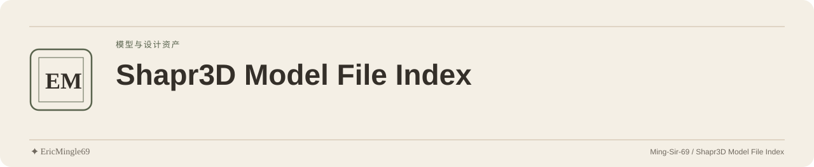

<picture>
  <source media="(prefers-color-scheme: dark)" srcset="readme-assets/header-dark.svg">
  <source media="(prefers-color-scheme: light)" srcset="readme-assets/header-light.svg">
  
</picture>

  <a href="README.md">简体中文</a> · <a href="README.en.md">English</a> · <a href="PERSONAL-NOTICE.md">✦ EricMingle69</a>

# Shapr3D 建模文件索引

## 项目定位

保存四个 3MF 建模文件，供浏览、下载和补充模型说明；目前是文件归档，没有应用源码。

## 阅读入口

| 入口 | 内容 |
| --- | --- |
| [分形结构](分形结构.3mf) | 现有 3MF 文件 |
| [分形虎钳](分形虎钳.3mf) | 现有 3MF 文件 |
| [手感改善](手感改善.3mf) | 现有 3MF 文件 |
| [肥皂盒](肥皂盒.3mf) | 现有 3MF 文件 |

## 从哪里开始

1. 在 Code 页面逐个下载文件，或下载仓库副本。
2. 使用支持 3MF 的查看、建模或切片工具导入。
3. 开始加工或打印前，先确认工具兼容性、单位、尺寸、材料与模型完整性。

## 使用边界

- 原上传说明表示大型模型未全部上传，计划拆分并分批补充；当前只以现有文件为范围。
- 工具版本、单位、导入兼容性和可打印性未经确认。
- 文件名只用于定位，不构成强度、尺寸或制造适用性承诺。

## 来源与原有许可

模型的具体作者、来源以及使用、修改、再分发范围尚未明确。原仓库没有 LICENSE/NOTICE，维护身份不替代模型作者归属。

---

文档维护：**✦ EricMingle69** · [Ming-Sir-69](https://github.com/Ming-Sir-69)  
[个人标识、许可与权限说明](PERSONAL-NOTICE.md) · 明暗页眉随 GitHub 主题自动切换。
